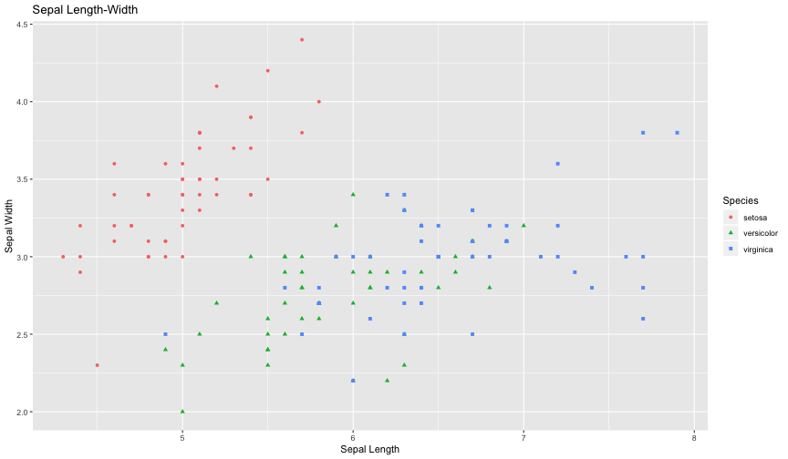

"Coursera : Developing Data Products : Week4 Assignment"
========================================================
author: Kike SF
date: "April 16, 2020"
autosize: true

Overview
========================================================
This is an RStudio shiny application developed as a part of final project in the Developing Data Products course in Coursera Data Science Specialization track. The application works with the Iris dataSet.

This famous (Fisher's or Anderson's) iris data set gives the measurements in centimeters of the variables sepal length and width and petal length and width, respectively, for 50 flowers from each of 3 species of iris. The species are Iris setosa, versicolor, and virginica.

In the App, we will create some basic Kmeans Plots to cluster data by lenght and width variables




APP Source and Deployment
========================================================


* The server.R and ui.R codes are posted on github at: <https://github.com/sashaxiv/datasciencecoursera/tree/master/Coursera%20IX%20-%20DevelopingDataProducts/ShinyApp/CourseProject>
* The App can be found at: <https://sashaxiv.shinyapps.io/courseproject/>

App Code UI
========================================================

```r
library(shiny)

vars <- setdiff(names(iris), "Species")

pageWithSidebar(
    headerPanel('Iris k-means clustering'),
    sidebarPanel(
        selectInput('xcol', 'X Variable', vars),
        selectInput('ycol', 'Y Variable', vars, selected = vars[[2]]),
        numericInput('clusters', 'Cluster count', 3, min = 1, max = 9),
        textInput("text", "Plot Title:", "text here"),
        submitButton("Submit")
    ),
    mainPanel(
        plotOutput('plot1'),
        verbatimTextOutput("text")
    )
)
```

App Code Server
========================================================

```r
# Server.R code
function(input, output, session) {
    
    # Combine the selected variables into a new data frame
    selectedData <- reactive({
        iris[, c(input$xcol, input$ycol)]
    })
    
    clusters <- reactive({
        kmeans(selectedData(), input$clusters)
    })
    
    output$plot1 <- renderPlot({
        palette(c("#E41A1C", "#377EB8", "#4DAF4A", "#984EA3",
                  "#FF7F00", "#FFFF33", "#A65628", "#F781BF", "#999999"))
        
        par(mar = c(5.1, 4.1, 0, 1))
        plot(selectedData(),
             col = clusters()$cluster,
             pch = 20, cex = 3)
        points(clusters()$centers, pch = 4, cex = 4, lwd = 4)
    })
    
    output$text <- renderText({
        paste("Title:", input$text)
    })
    
}
```
